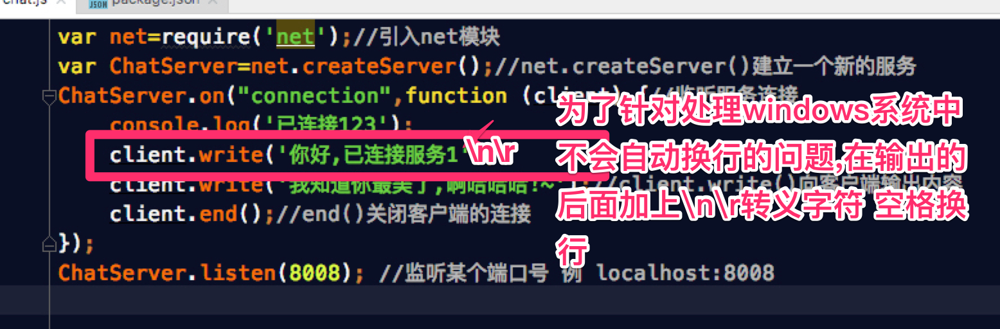
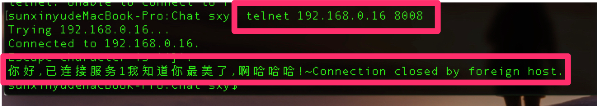
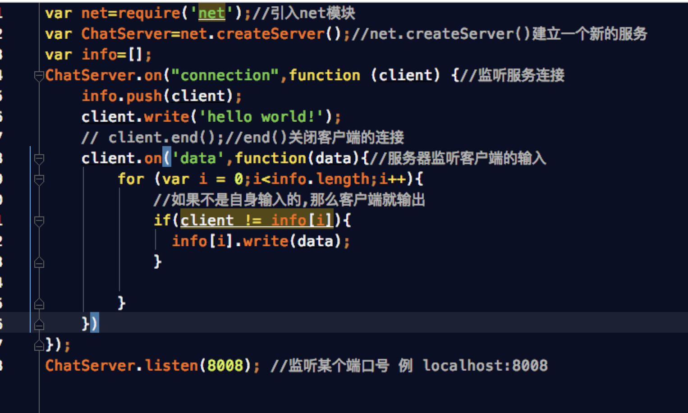
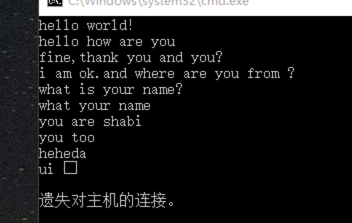
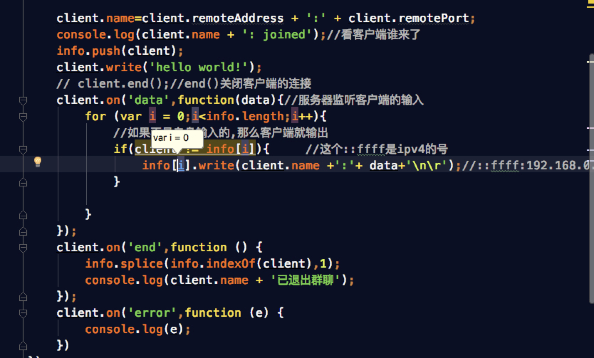
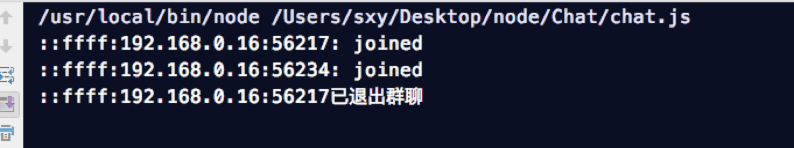

以下完成三个实例为练习

1.连接服务器成功并在客户端输出"Hello World"

> 思路:
> 
> a.首先引入node的net模块
> 
> b.初始化建立一个新的服务,然后监听这个服务的连接,并对这个连接进行处理
> 
> c.用telnet模拟拨号,使用方式 telnet url 端口号(划重点了!!!这里的端口号一定记住是空格!空格!空格!不是冒号!)
> 
> d.用新建的服务监听某个端口号
> 
> 代码如下:
> 

当然一定记得把服务跑起来...结果如下

---

2.建立一个简易版即时通讯工具

> 思路如下:
> 
> a.首先要建立一个数组用来存放每个客户端输出的内容
> 
> b.监听客户端的输入
> 
> c.遍历客户端输出消息数组,判断是不是自身输出,如果不是,则输出
> 
> 代码如下
> 

测试环境,mac终端+虚拟机windows cmd +同事电脑. 注意:window如何开启telnet? 更改或删除应用->启用或关闭windows功能->开启telnet客户端

发现区别: windows输入消息的时候是即时输出,并有中文乱码的问题, 而mac 则是一句话结束,按下回车才发送

测试结果: 成功 

---

3.完善即时通讯

> 需求:
> 
> a.加上名字(谁发言)
> 
> b.监控谁退出群聊
> 
> c.监测连接出错的时候
> 
> 代码如下
> 

测试结果如下

---

总结: 现在的qq聊天类的通讯都是半即时通讯,通常不会直接使用即时通讯的方式,不过好处在于node可以及时监测用户是否退出,及时回收内存,清空缓存.
  
注:通讯类细节请google nodejs Net模块